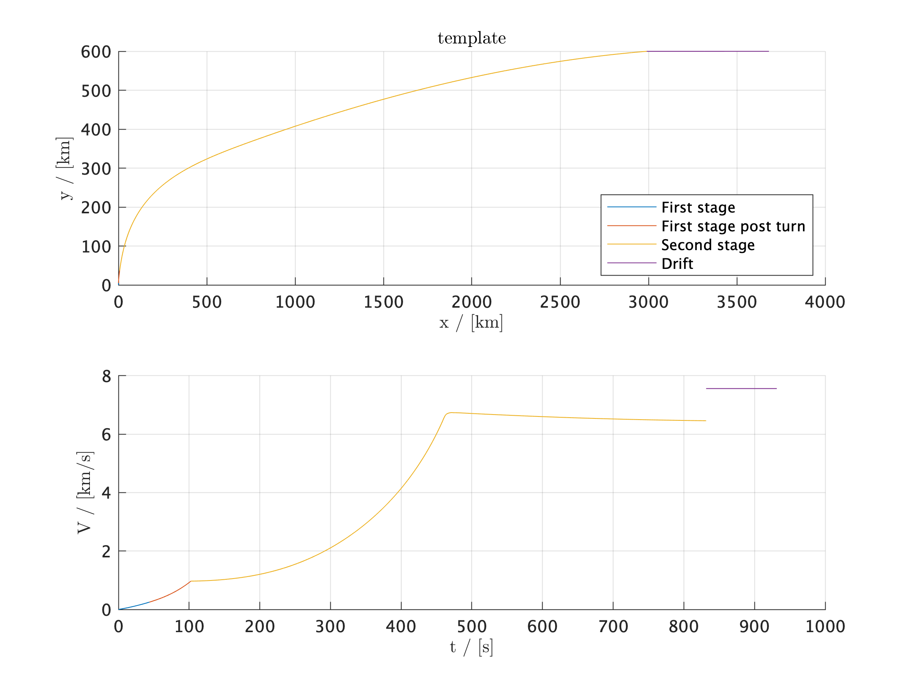

# Conceptual Study of Expendable versus Reusable Launch Vehicles

The *Conceptual Study of Expendable versus Reusable Launch Vehicles* is a project given in the [KTH](https://www.kth.se) course [SD2900 Fundamentals of Spaceflight](https://www.kth.se/student/kurser/kurs/SD2900?l=en), autumn 2019.

## Given instructions

>The proposal is that you shall conceptually design **two launch vehicles** — **one fully expendable and one partially or fully reusable** — which will **launch a 1000 kg satellite to a 600 km orbit** and then provide a reasonably detailed comparison between them in terms of *performance*, *cost* and *environmental impact*. (...)

## About this program

This program aims to simulate two dual stage rocket; one reusable and one expendable.

### Example

This plot is generated by running the current `main.m`.

### Usage

To use this program: clone the repository and generate a file similar to `template.m`.

## TODO

- [ ] Upload .pdf report