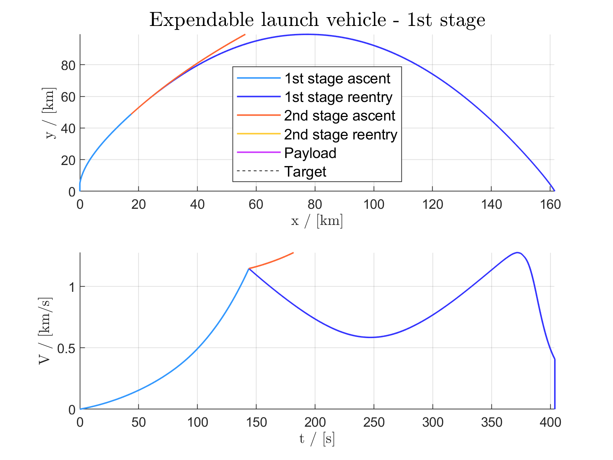
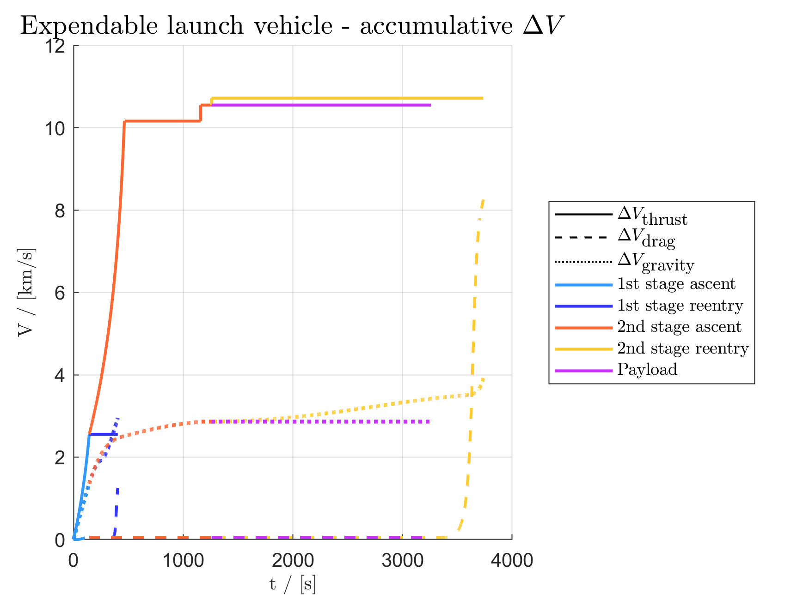
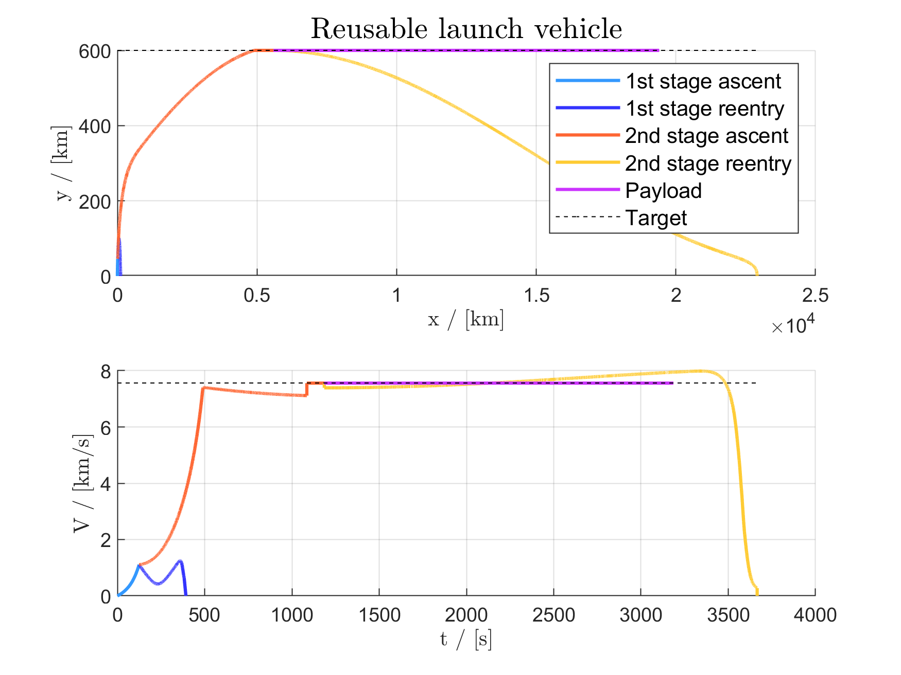
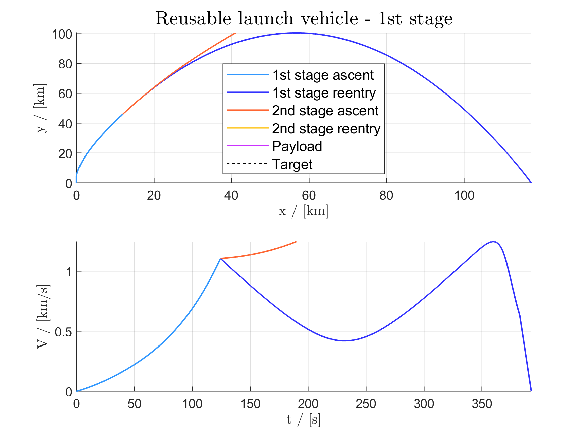
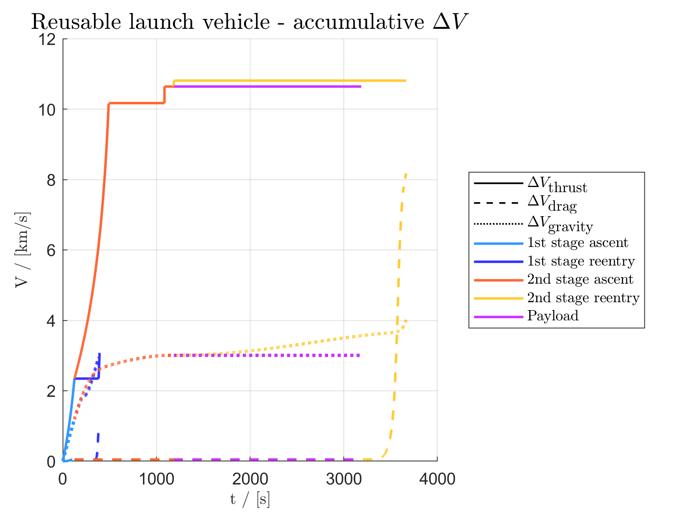

# Conceptual Study of Expendable versus Reusable Launch Vehicles

The *Conceptual Study of Expendable versus Reusable Launch Vehicles* is a project given in the [KTH](https://www.kth.se) course [SD2900 Fundamentals of Spaceflight](https://www.kth.se/student/kurser/kurs/SD2900?l=en), autumn 2019.

## Assignment

>The proposal is that you shall conceptually design **two launch vehicles** — **one fully expendable and one partially or fully reusable** — which will **launch a 1000 kg satellite to a 600 km orbit** and then provide a reasonably detailed comparison between them in terms of *performance*, *cost* and *environmental impact*. (...)

This program simulates two conceptually designed two-stage launch vehicles in a gravity turn that places the payload in the target orbit. One rocket is expendable, similar to the *Vega* rocket, and the other rocket is reusable, similar to the *Falcon 9* rocket. Both ascent and reentry is simulated for both stage.

## Method

1. The first stage performs a vertical ascent to a specified height with low dynamic pressure.
2. At this height the first stage does a programmed turn. At this turn the rocket will be exposed to lift which is why it is done at low dynamic pressure, *q&#8734;*.
3. The first stage is simulated through a gravity turn with a high and constant burn rate. Stage separation is performed when the first stage has burnt up all but a specified percentage of its fuel. The reusable first stage requires spare fuel that is later used for landing.
4. The reentry of the first stage is simulated through a gravity turn without thrust. The expendable first stage crashes into the ocean. The reusable first stage performs a &#916;*V* so that is lands with zero vertical speed at ground level. 
5. The second stage is simulated through a gravity turn. The burn rate is constant until the apogee of the elliptical orbit intersects the target altitude, at that point the burn rate is cut of.
6. Once the target altitude is reached the second stage performs a &#916;*V* so that the target orbital velocity is reached. The payload is now in its desired orbit.
7. The second stage now performs a second &#916;*V* so that the perigee intersects the the Earth and thus reenters and burns up in the atmosphere.

## Results

The following plots are generated from running `Expendable_rocket_final_version.m` and `Reusable_rocket_final_version.m`.

---

### Expendable rocket

---

### Reusable rocket

---

## Usage

To use this program: clone the repository and create a copy of `template.m`. Design a rocket and enter its parameters into the program by following the instructions in `template.m`.